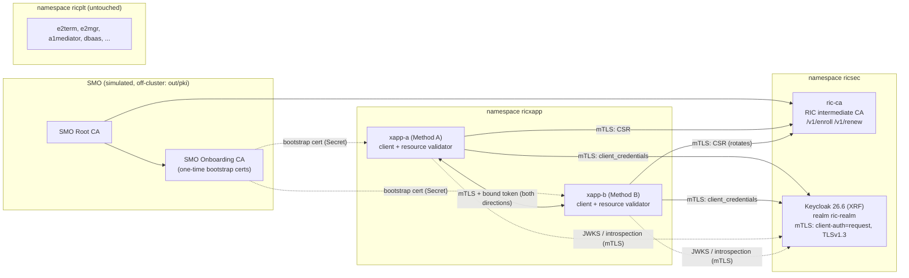
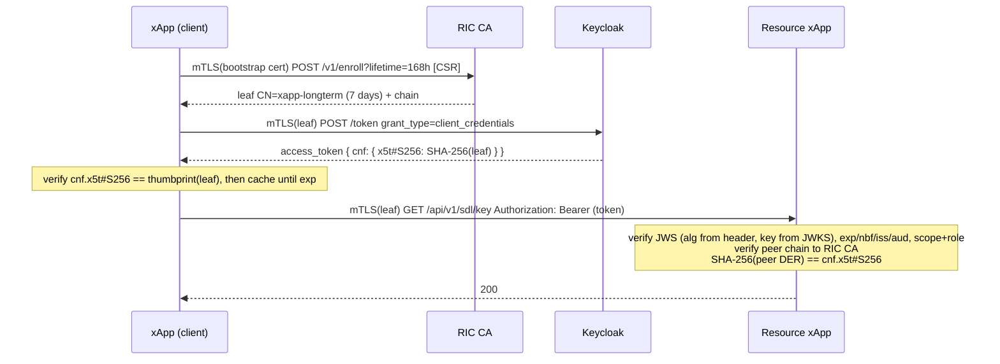
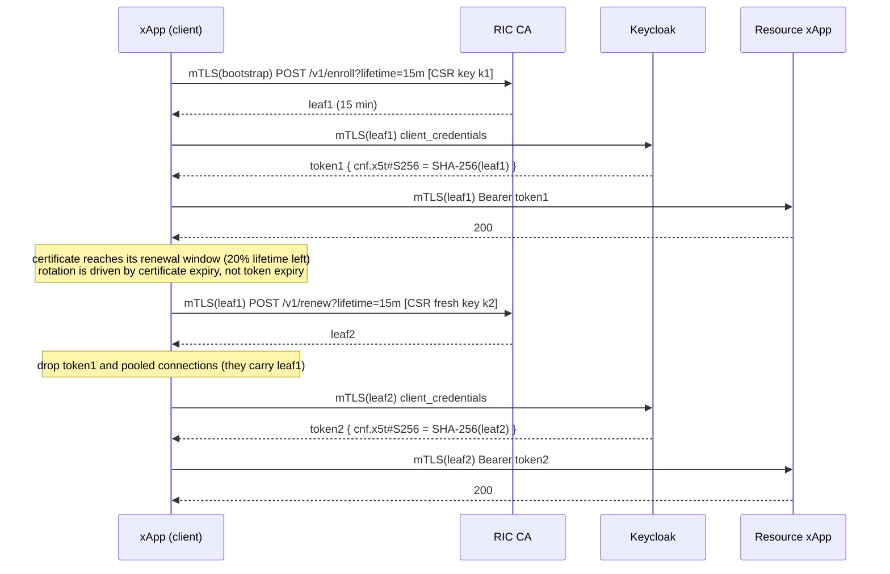
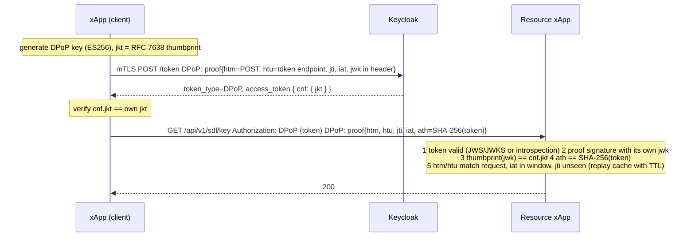

# Sender-Constrained Token Binding for O-RAN xApps (classical phase)

OAuth 2.0 authorization for xApps on the OSC Near-RT RIC where **possession of an access
token alone is never sufficient**. Keycloak (the XRF) issues tokens bound to key material;
the resource xApp enforces the binding.

| Method | Binding | Confirmation claim | Certificate lifetime | Keycloak client |
|---|---|---|---|---|
| A | RFC 8705 mTLS certificate-bound, long-term identity key | `cnf.x5t#S256` | days–weeks (`LONGTERM_CERT_LIFETIME`, default 168h) | `xapp-longterm` |
| B | RFC 8705 mTLS certificate-bound, ephemeral identity key | `cnf.x5t#S256` | minutes–hours (`EPHEMERAL_CERT_LIFETIME`, default 15m) | `xapp-ephemeral` |
| C | RFC 9449 DPoP | `cnf.jkt` | n/a (JWK) | `xapp-dpop` |

A and B are **the same Keycloak configuration and the same client code path**
(`xapp-client/certbound.go`), parameterised by certificate lifetime and a key-rotation flag.

Scope: classical cryptography only. Service mesh / sidecars are deliberately not used:
Keycloak and every xApp terminate mTLS themselves, so the client certificate is visible
directly to the X.509 client authenticator and to the resource validator.

## Architecture



Trust model

* **SMO root CA** (simulated) signs two intermediates. Its key never enters the cluster.
* **SMO onboarding CA** issues one-time *bootstrap* certificates. They are accepted only by
  the RIC CA's `/v1/enroll`, and each is single-use (ledger keyed by issuer + serial).
  The DNS names in the bootstrap certificate are the only names the xApp may later obtain.
* **RIC intermediate CA** (`ric-ca` service) issues operational xApp identity certificates
  (`CN=<client_id>,OU=xApps,O=O-RAN-RIC`, EKU clientAuth+serverAuth). It is the only trust
  anchor configured in Keycloak (`--truststore-paths`) and in resource xApps.
* Every connection is TLS 1.3 mTLS; the CA sets the subject from the authenticated identity,
  never from the CSR.

## Repository layout

| Path | Contents |
|---|---|
| `config/testbed.env` | the single configuration file (namespaces, hostnames, ports, DNs, lifetimes) |
| `ca/scripts/gen-pki.sh` | generates SMO root, onboarding CA, RIC intermediate CA, server certificates; verifies with `openssl verify` |
| `ca/enroll`, `ca/cmd/ric-ca` | enrollment service (bootstrap check, one-time ledger, lifetime policy, CSR proof-of-possession) |
| `ca/cmd/smo-sim` | simulated SMO onboarding: issues bootstrap credentials |
| `ca/k8s/ric-ca.yaml` | Deployment + Service in `ricsec` |
| `keycloak/k8s/keycloak.yaml` | Keycloak Deployment + Service in `ricsec` |
| `keycloak/ric-realm.json` | realm export: `xapp-longterm`, `xapp-ephemeral`, `xapp-dpop` (+ test-only `xapp-unbound-probe`), `ric-sdl-access` scope and role |
| `xapp-client/` | Go client library (Methods A/B/C behind one `Client` interface) |
| `xapp-resource/` | resource-side validator middleware (local validation and introspection) |
| `demo-xapp/` | demo xApp (client + protected SDL-style API), manifests for `xapp-a` and `xapp-b` |
| `test/cmd/sectest` | security test suite (positive + negative), CSV output |
| `bench/cmd/bench` | measurement harness, CSV output |
| `internal/jose` | minimal JOSE: alg-dispatched JWS verification, JWK thumbprints, JWKS cache, DPoP signer |
| `internal/pki`, `internal/netx` | certificate thumbprint/chain verification, transports, htu normalisation |

## What Keycloak does and what this project does

Keycloak (no custom code): authenticates the xApp over mTLS (`client-x509`, exact subject DN
match); issues the token with `cnf.x5t#S256` when *OAuth 2.0 Mutual TLS Certificate Bound
Access Tokens Enabled* is on (`tls.client.certificate.bound.access.tokens`) or `cnf.jkt` when
*Require DPoP bound tokens* is on (`dpop.bound.access.tokens`).

This project: the RIC CA and enrollment; Method B's rotation; DPoP proof generation; and the
enforcement at the resource server, which Keycloak cannot do.

> Keycloak issues a token even when the client certificate never reached it (the `cnf`
> claim is then simply missing). The client library therefore checks every issued token and
> returns `ErrBindingMissing`; `make verify-keycloak` automates the same check; and the
> resource validator rejects tokens without `cnf` (`cnf_missing`).

## Per-method call sequences

### Method A — long-term certificate



### Method B — ephemeral certificate (same Keycloak client configuration as A)



`ROTATION_POLICY=every-token` rotates the key before every token issuance instead.

### Method C — DPoP



## Resource-side validator

`xappresource.Validator.Middleware(mode, next)` is the single enforcement point; `mode` is
`local` (JWS + JWKS) or `introspection` (RFC 7662 call to Keycloak authenticated with the
resource xApp's own mTLS identity). Binding checks are identical in both modes. Every
rejection is logged (`authz_rejected`, `reason_code`, `reason`) and returned as
`{"error","reason_code","reason"}`. Fail-closed rules: missing/malformed/unrecognised `cnf`,
missing certificate, unverifiable chain, expired certificate, bearer use of a DPoP token,
missing/multiple/invalid proof, full replay cache — all are rejections.

## Reproduction guide

Prerequisites on the RIC node: Kubernetes with `kubectl` access, Docker and `ctr`
(containerd), OpenSSL, `jq`, `envsubst`, Go ≥ 1.22 (`~/tools/go` is used if `go` is not on
`PATH`). The Keycloak image in `config/testbed.env` must be pullable or already present.

```bash
cd ~/xapp-token-binding
make up                 # PKI, images, ricsec (CA + Keycloak + realm), onboarding, xapp-a/xapp-b
make verify-ca          # milestone 1: leaf on demand, openssl verify, one-time bootstrap
make verify-keycloak    # milestone 2: cnf.x5t#S256 present and equal to the certificate thumbprint
make test               # milestones 3-5: security suite -> results/security-tests.csv
make bench              # milestone 6: -> results/bench.csv, results/bench-env.csv
make unit               # offline unit tests (RFC 7638 vector, validator end-to-end with httptest)
make logs               # validator decisions and peer calls of the demo xApps
make down               # remove everything this project deployed (RIC untouched)
```

Useful knobs (environment for `make bench`): `BENCH_TOKEN_N`, `BENCH_RESOURCE_N`,
`BENCH_ROTATION_N`, `BENCH_CONCURRENCY`, `BENCH_RPS_DURATION`, `BENCH_ROTATION_LIFETIMES`,
`BENCH_METHODS`. `bench.csv` has a fixed header and row order; run metadata goes to
`bench-env.csv`, so result files from different runs diff cleanly.

Tools that run on the node (`sectest`, `bench`, `verify-*`) reach Services by their in-cluster
DNS names through `DIAL_OVERRIDES` (name:port → ClusterIP:port, written by `make host-env`),
so TLS server-name checks and DPoP `htu` values are exactly those used inside the cluster.

## Lab-VM notes and deviations

* **No service mesh.** Istio is not used; Keycloak and xApps terminate mTLS directly, so no
  XFCC handling is needed. `ricplt` is not modified in any way (E2/SCTP unaffected).
* **Realm import through the admin API** (`make import-realm`) instead of `--import-realm`:
  identical content, but failures are reported instead of stopping the server.
* **Keycloak runs `start --db=dev-file --cache=local`** (single node, H2 file in an
  `emptyDir`). A new Keycloak pod needs `make import-realm` (done by `make restart-keycloak`).
* **Probe timeouts are generous** (10–15 s): on a 4 vCPU VM the JVM stalls under load and
  1 s defaults cause the kubelet to kill a healthy Keycloak.
* **Single CA replica**: the one-time bootstrap ledger lives in the pod's `emptyDir`.
  Re-onboard the demo xApps with `make restart-xapps`.
* **Benchmarks run on the same VM** as the RIC and Keycloak; absolute numbers include
  kube-proxy hops and CPU contention and should be read comparatively.

## Post-quantum readiness (not implemented here)

* The validator never names an algorithm: it reads `alg` from the JWS header and dispatches
  through `jose.RegisterVerifier`; new key types register through `jose.RegisterKeyType`
  (RFC 7638 members + parser), e.g. ML-DSA / `AKP`.
* Verification keys always come from the configured `JWKS_URL`.
* `x5t#S256`, `jkt` and `ath` checks are SHA-256 hashes, independent of the signature algorithm.
* Token issuance goes through one `Issuer` interface; `Client.SetIssuer` inserts a
  re-signing shim without touching call sites.

## Post-quantum phase (ML-DSA signatures, ML-KEM key exchange)

`PQ_MODE=true` switches the testbed from classical to post-quantum credentials. The
full record of code changes is in [docs/PQC-CHANGELOG.md](docs/PQC-CHANGELOG.md).

| Concern | Classical | Post-quantum |
|---|---|---|
| Token signature | RS256 (Keycloak) | **ML-DSA-65**, issued by the `pq-shim` |
| xApp identity certificate | EC P-256 | **ML-DSA-65**, issued by the post-quantum branch of the RIC CA |
| DPoP proof (Method C) | ES256 | **ML-DSA-44** |
| TLS key exchange | X25519 / X25519MLKEM768 | **X25519MLKEM768 required** (`PQ_KEX_ONLY`) |
| Confirmation claims | `x5t#S256`, `jkt` | unchanged: both are SHA-256 values |

Keycloak (Java 21) supports neither ML-DSA nor ML-KEM, so it stays classical: it
authenticates the xApp and makes the authorization decision, and the **pq-shim**
upgrades its token into an ML-DSA-signed token bound to the xApp post-quantum
credential, after the client proves possession of *both* credentials in one request
(the classical binding is re-verified with the same `xappresource.Validator` a resource
server uses; the post-quantum binding arrives as an ML-DSA proof carrying the
certificate chain in `x5c` or the AKP key in `jwk`).

All JOSE work is done by `github.com/lestrrat-go/jwx/v4`, and the post-quantum
primitives come from the Go 1.27 standard library (`crypto/mldsa`, `crypto/x509`,
`crypto/tls`). No cryptography is hand-written.

### Running it

```bash
make up                      # classical testbed (also builds the post-quantum PKI and the shim)
make pq-up                   # switch the CA, the shim and the demo xApps to post-quantum mode
make classical-up            # switch back

scripts/run-method-a.sh --pq # Method A end to end, printing every step
scripts/run-method-b.sh --pq # Method B, including a key rotation
scripts/run-method-c.sh --pq # Method C, including a DPoP proof replay
```

Each script prints the configuration, onboarding and enrollment (both credentials), the
Keycloak token and its ML-DSA upgrade with the size change, the negotiated TLS group,
resource calls under local validation and introspection, the method-specific behaviour,
and the negative test that proves the token alone is not enough - then the matching
log lines from the resource xApp, the shim and the RIC CA. Drop `--pq` for the
classical run.
"# O-RAN-PQC-Token-Binding" 
